# Hi, I'm Awsaf Zaman Onom 👋

### Founder-Engineer | Building Cross-Border Digital Ventures & AI Products

**Turning ideas into scalable ventures — from AI marketplaces to climate-tech products.**

---

## 🚀 About Me

I'm an A-Level student in Dhaka building at the intersection of **entrepreneurship, product design, and technology**. I founded a cross-border digital services business serving 3,000+ customers, and I'm now co-building an AI & SaaS marketplace for global software distribution.

Alongside the business work, I design AI-powered products, compete in international science olympiads, and lead youth delegations of 1,000+ people. I care about building things that scale — companies, communities, and climate solutions.

---

## 🛠️ Tech & Professional Skills

**Languages & Scripting**

**Design & Product**

**Workspace & Collaboration**

**Business & Growth**

---

## 💡 Entrepreneurship & Leadership

### 🏢 Founder — Subscription Lovers *(2020 – Present)*
- Built a cross-border digital services business serving **3,000+ customers**
- Solved for international payments, platform access, and customer trust at scale

### 🤝 Co-Founder — Vendiac.com (AI & SaaS Marketplace) *(2025 – Present)*
- Co-building a marketplace for cross-border software distribution
- Owns seller onboarding, platform operations, and marketplace policy

### 🛒 Digital Marketplace Seller — G2G, SkyCoach, Mmonster, U7BUY *(2024 – Present)*
- Runs stores across four international marketplaces, managing orders and client relations

### 🎙️ Under-Secretary-General, Delegate Affairs — Emissary International MUN *(2024)*
- Led one of three senior departments, managing onboarding for **1,000+ delegates**

### 🍽️ Director, Food & Distribution — Emunga Model United Nations *(2024)*
- Coordinated meal planning, catering, and food distribution for all conference participants

### 📰 Vice President — Josephite Wall Magazine Club *(2022 – 2023)*
- Led a 12-member committee overseeing ~70 executive members; secured event sponsorships

### 🔬 Organizing Secretary — Scintilla Science Club *(2022)*
- Led a 12-volunteer tech team; recognized as one of the Best Executive Board Members

### 🎮 Co-Owner — XiGC Esports Organisation *(2020 – 2022)*
- Grew a gaming community to **4,000+ Discord members**; organized tournaments and events

---

## 📂 Featured Projects

### 🩺 ZeroOne — AI-Powered Health Recovery Platform *(2026)*
Designed the full UI/UX and product architecture for an AI recovery platform supporting 8 chronic conditions via personalized guidance and peer networks.
`Figma` `AI Product Design` `UX Architecture`

### 🌍 ClimaCore — SDG 13 Climate Action App *(2025)*
Built an award-winning climate app with AI learning, GPS gamification, and disaster alerts — won 1st place at a global contest of 161 teams.
`Mobile App Design` `AI/ML Concepts` `Gamification`

### ♻️ Recytron — Environmental Robotics Project *(2024)*
Designed a robotic concept combining renewable-powered air purification with IoT-based flood prediction using water-level sensors.
`IoT` `Cloud Monitoring` `Sensors`

### ⚡ Carbon-Based Energy's Invulnerability & Implementation Methodology *(2022)*
Researched Carbon Capture and Storage (CCS) methods, geological storage, and industrial utilization to improve sustainability of carbon-based energy.
`Research` `Sustainability` `Energy Systems`

### 🔋 Generation & Utilization Nexus of Decarbonized Energy *(2019)*
Designed an integrated renewable energy framework combining solar, wind, sound, and waste-heat tech into scalable smart grids — won 3rd Prize nationally.
`Renewable Energy` `Systems Design`

### 🧬 CRISPR: From Genome Sequence to Global Warming *(2018)*
Explored CRISPR-Cas9 genome editing, proposing bioluminescent algae as a sustainable lighting solution to cut energy use.
`Biotechnology` `Research` `Climate Tech`

---

## 🥇 Awards & Recognition

<table>
<tr>
<td width="50%" valign="top">

**🥇 1st Place — 15th E-icon World Contest**
 
*Ministry of Education, South Korea & KEFA · 2025*
  
Won globally for ClimaCore among 161 teams from 37 countries. Awarded on stage by South Korea's Minister of Education.

 

**✍️ High Honors — Lumiere Scholars Essay Award**
 
*Lumiere Education · 2026*
  
Selected from 2,100+ essays worldwide; awarded a $1,250 research scholarship.

 

**🏅 4x Champion — Inter-School Science Festival**
 
*Scintilla Science Club · 2015, 2017, 2018, 2022*
  
Won 1st place four times for STEM research and innovation.

</td>
<td width="50%" valign="top">

**🌐 8th Place — Bangladesh TST, International Earth Science Olympiad (IESO)**
 
*BYEI · 2025*
  
1 of 30 national finalists; certificate presented by France's Ambassador to Bangladesh.

 

**🔭 National Qualifier — International Olympiad on Astronomy and Astrophysics (IOAA)**
 
*BDOAA · 2026*
  
Qualified through Bangladesh's national selection pathway for the international olympiad.

</td>
</tr>
</table>

---

## 🎓 Programs & Fellowships

<table>
<tr>
<td width="50%" valign="top">

**🎓 Full Scholarship — Young Founders Summit**
 
*National Youth Council of Singapore · 2025–26*
  
1 of 10 fully-funded founders selected from 70 across Asia for a 6-month founder program in Singapore.

</td>
<td width="50%" valign="top">

**🌍 Fully Funded Delegate — Intl. Geoscience Youth Movement**
 
*Prayoga Institute / Ministry of Earth Sciences, Government of India · 2026*
  
1 of 22 students selected globally for a residential Earth science workshop in Bangalore.

</td>
</tr>
</table>

---

## 🎓 Education

**Cambridge International AS & A-Levels** — Mathematics, Physics, Economics *(2025 – 2027)*
**Secondary School Certificate (SSC)** — St Joseph Higher Secondary School *(2023)*

---

## 📊 Snapshot

### 🗺️ Founder Journey Timeline

```mermaid
flowchart LR
    A["🎮 2020<br/>XiGC Esports<br/>Co-Founded"] --> B["🛍️ 2020<br/>Subscription Lovers<br/>Founded"]
    B --> C["🏆 2022<br/>3rd Prize<br/>Renewable Energy"]
    C --> D["🌐 2024<br/>Marketplace Selling<br/>G2G, SkyCoach+"]
    D --> E["🇸🇬 2025<br/>Young Founders Summit<br/>Singapore"]
    E --> F["🥇 2025<br/>E-icon World Contest<br/>1st Place"]
    F --> G["🚀 2025<br/>Vendiac Co-Founded"]
    G --> H["🇮🇳 2026<br/>Geoscience Youth<br/>Movement, India"]

    style A fill:#8A2BE2,color:#fff
    style B fill:#2E8B57,color:#fff
    style C fill:#FF6F00,color:#fff
    style D fill:#1DA1F2,color:#fff
    style E fill:#D14836,color:#fff
    style F fill:#FFD700,color:#000
    style G fill:#4285F4,color:#fff
    style H fill:#00C4CC,color:#fff
```

| 🥧 Focus Allocation | 📊 Ventures & Roles by Category |
|:---:|:---:|
|  |  |

### 📈 Subscription Lovers — Customer Growth

%27,fill:true,tension:0.4%7D%5D%7D,options:%7Blegend:%7Blabels:%7BfontColor:%27white%27%7D%7D,scales:%7ByAxes:%5B%7Bticks:%7BfontColor:%27white%27%7D%7D%5D,xAxes:%5B%7Bticks:%7BfontColor:%27white%27%7D%7D%5D%7D%7D%7D)

---

*Open to collaborations, ventures, and conversations about tech + impact.*

